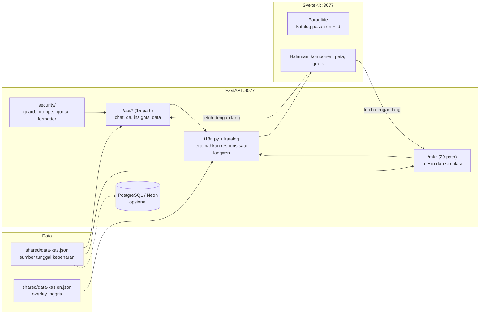

# Omnigistic

**Purwarupa pendukung keputusan dua bahasa (Inggris / Indonesia) untuk kasus ISCEA Global Case Competition 2026 "Delivering Promises" (GC Logistics).** SvelteKit 2 (Svelte 5 runes, adapter-node) + FastAPI (Python, ML), berjalan sepenuhnya di `localhost`: tanpa deploy, tanpa ketergantungan cloud.

[](https://svelte.dev)
[](https://svelte.dev)
[](https://vite.dev)
[](https://www.typescriptlang.org)
[](https://tailwindcss.com)
[](https://fastapi.tiangolo.com)
[](https://www.python.org)
[](https://nodejs.org)
[](https://inlang.com/m/gerwegn8/plugin-js)
[](#lisensi)

> English: **[README.md](README.md)**

---

## Daftar Isi

- [Tentang](#tentang)
- [Enam pertanyaan strategis](#enam-pertanyaan-strategis)
- [Fitur](#fitur)
- [Tech stack](#tech-stack)
- [Arsitektur](#arsitektur)
- [Struktur project](#struktur-project)
- [Mulai cepat](#mulai-cepat)
- [Konfigurasi](#konfigurasi)
- [Dua bahasa (Inggris / Indonesia)](#dua-bahasa-inggris--indonesia)
- [Mesin dan model](#mesin-dan-model)
- [Sistem desain](#sistem-desain)
- [Keamanan](#keamanan)
- [Pengujian dan verifikasi](#pengujian-dan-verifikasi)
- [Angka dan sumbernya](#angka-dan-sumbernya)
- [Dokumentasi](#dokumentasi)
- [Pemecahan masalah](#pemecahan-masalah)
- [Rencana ke depan](#rencana-ke-depan)
- [Kontribusi](#kontribusi)
- [Lisensi](#lisensi)
- [Kredit dan atribusi](#kredit-dan-atribusi)
- [Penulis](#penulis)

---

## Tentang

Kasus ini mempertanyakan bagaimana **GC Logistics** (operator logistik fiktif Indonesia dalam kasus ISCEA 2026) memperbaiki bisnis yang **beban fulfilment-nya tumbuh lebih cepat daripada penjualan**. Antara 2020 dan 2023 beban fulfilment naik 54,9% sementara net sales naik 48,7%, jaringan mitra tumbuh 23,9 kali (20 menjadi 478 mitra) tanpa penyelarasan permintaan, dan perusahaan mencatat kerugian pada 2023.

Repositori ini adalah **purwarupa yang benar-benar berjalan** dari *Omnigistic*: lapisan operasi berbasis data yang diajukan untuk menjawab enam pertanyaan strategis kasus, memakai angka kasus itu sendiri (Table 1 sampai Table 4, Figure 1 dan Figure 2).

Apa isinya:

- **Purwarupa pendukung keputusan**, bukan layanan produksi. Setiap mesin menyediakan kontrol interaktif (slider, ambang, toggle) yang menghitung ulang hasil, bukan menampilkan grafik statis.
- **Berjalan sepenuhnya lokal** (hanya `localhost`). Format submission adalah video maksimal 15 menit, jadi aplikasi dirancang untuk didemokan langsung dari laptop.
- **Dua bahasa**, Inggris default dan Indonesia di `/id`, dengan pengalih bahasa di antarmuka.
- **Dapat ditelusuri**: angka turunan dihitung di satu tempat (`backend/app/ml/metrics.py`) dan direkonsiliasi dengan dokumen kasus, termasuk ketidaksesuaian yang ada di dokumen itu sendiri.

Yang bukan: ini bukan aplikasi ter-deploy, tidak punya kontrak data resmi dengan GC Logistics, dan model ML-nya dilabeli sebagai purwarupa presentasi (lihat label kejujuran di antarmuka dan bagian [Angka dan sumbernya](#angka-dan-sumbernya)).

---

## Enam pertanyaan strategis

Setiap pertanyaan dipetakan ke satu mesin dan satu halaman. Semuanya dapat diakses dari setiap portal peran.

| # | Pertanyaan | Mesin (endpoint) | Halaman |
|---|---|---|---|
| Q1 | Haruskah GC beralih dari Direct Operation ke Regional Sponsor? | `GET\|POST /ml/sponsor/compare`, `GET /ml/sponsor/sensitivity` | `/dashboard/pusat/digital-twin` |
| Q2 | Bagaimana menghadapi fluktuasi demand yang dramatis? | `GET\|POST /ml/sim/surge`, `GET\|POST /ml/forecast` | `/dashboard/hub/surge`, `/dashboard/hub/forecast` |
| Q3 | Bagaimana memperbaiki sistem COD? | `POST /ml/cod-cash/risk`, `POST /ml/cod-intel`, `GET /ml/cod-risk/demo` | `/dashboard/kurir/cod-cash`, `/dashboard/kurir/cod-intel` |
| Q4 | Bagaimana roadmap dan benefit-cost keberlanjutan? | `GET /ml/ev-bca`, `GET /ml/metrics/fleet` | `/dashboard/pusat/ev-bca`, `/dashboard/data/fleet` |
| Q5 | Apakah ekspansi pasar menguntungkan? | `GET\|POST /ml/expansion/roi` | `/dashboard/pusat/expansion` |
| Q6 | Strategi lain apa yang memangkas biaya tanpa mengorbankan pendapatan? | `GET /ml/pnl/waterfall`, `GET\|POST /ml/modalshift/optimize` | `/dashboard/pusat/pnl`, `/dashboard/data/multimodal` |

---

## Fitur

### Enam portal peran

Satu shell bersama, enam sudut pandang atas data yang sama. Navigasi menyesuaikan peran (4 item konten ditambah asisten AI).

| Portal | Peran | Fokus |
|---|---|---|
| `/dashboard/pusat` | Pusat (Dalila) | Keuangan, Digital Twin, ekspansi jaringan, ROI, waterfall biaya |
| `/dashboard/hub` | Hub (Marwah) | Utilisasi, load balancing, alert kapasitas, forecast demand |
| `/dashboard/kurir` | Kurir (Baits) | Tugas pengantaran, route intelligence, triase COD, rekonsiliasi kas, PUDO |
| `/dashboard/data` | Data (Virgiawan) | Address Intelligence, komplain, multimodal control tower, armada dan emisi |
| `/dashboard/customer` | Pembeli (Sari) | Belanja, keranjang, checkout COD, pelacakan pesanan, kehadiran penerima |
| `/dashboard/seller` | Penjual (Rina) | Produk, pesanan masuk, skor pelanggan |

### Mesin dan simulasi interaktif

- **Mesin tantangan** untuk Q1 sampai Q6 (tabel di atas), masing-masing dengan kontrol parameter langsung.
- **Load balancing jaringan**: heuristik transportasi yang mengalihkan overflow dari hub di atas ambang kritis ke hub yang masih punya headroom, dengan lantai aman dan batas maksimum porsi yang dialihkan.
- **Forecast demand**: indeks musiman + tren OLS + penanda event, dengan slider kekuatan event untuk simulasi what-if.
- **Metrik dan rekonsiliasi**: angka turunan dan pemeriksaan audit untuk setiap tabel kasus.
- **Modal shift optimizer**: pemilihan moda per koridor terhadap objektif berbobot (biaya, emisi, SLA).
- **Route intelligence**: kandidat koridor dengan model waktu tempuh BPR, memberi skor jalur tercepat dan paling efisien.

### Halaman interaktif

Kontrol yang benar-benar mengubah hasil di setiap halaman simulasi (tidak ada preset statis):

| Halaman | Kontrol |
|---|---|
| `/dashboard/hub/surge` | Slider amplifikasi puncak dan kapasitas elastis, plus preset musiman, festival, dan Double 12 |
| `/dashboard/hub/capacity` | Level permintaan (lembah, normal, puncak) yang menskala volume dan overflow per hub |
| `/dashboard/hub/load-balance` | Tiga ambang (kritis, lantai aman, porsi maksimum) dan rencana pengalihan yang dihitung ulang |
| `/dashboard/hub/forecast` | Tiga slider kekuatan event yang menghitung ulang proyeksi dan fluktuasi |
| `/dashboard/kurir/cod-cash` | Slider porsi COD plus empat intervensi digital |
| `/dashboard/kurir/cod-intel` | Porsi COD, paket per shift, dan toggle intervensi |
| `/dashboard/kurir/tasks` dan `/dashboard/kurir/pudo` | Slider kepadatan rute dan pemilih jalur (tercepat atau paling efisien) |
| `/dashboard/pusat/pnl` | Toggle tuas keberlanjutan yang menyusun ulang jembatan cost-to-sales |
| `/dashboard/pusat/expansion` | Slider capex per hub dan target utilisasi |
| `/dashboard/pusat/roi` | Empat tuas (COD, EV, BBM, komplain) yang menghitung ulang ROI, capex, dan payback |
| `/dashboard/pusat/digital-twin` | Parameter Direct dibanding Regional Sponsor dengan sensitivitas |
| `/dashboard/data/multimodal` | Bobot biaya, emisi, dan kecepatan plus batas SLA |
| `/dashboard/data/fleet` | Slider adopsi EV yang mengubah bauran armada dan emisi |
| `/dashboard/data/address` | Alamat bebas dengan fuzzy matching ke tiga kandidat |
| `/dashboard/data/ev-sites`, `/dashboard/data/complaint` | Parameter koridor dan cakupan dengan proyeksi yang dihitung ulang |

### Peta

Peta Leaflet dengan legenda yang bisa dibuka-tutup: utilisasi hub (pencarian, filter tingkat dan region, daftar hub yang bisa diurutkan, kartu detail), simulasi pengantaran (rute, telemetri, drop PUDO), dan disambiguasi alamat (tiga kandidat untuk nama jalan yang sama). Titik PUDO mitra memakai koordinat dan alamat nyata dari OpenStreetMap.

### Alur pesanan lintas peran

Perjalanan pesanan tersimulasi yang disimpan di `localStorage`: checkout pembeli, penanganan kurir (dikemas, dijemput, transit, dalam pengantaran, terkirim), konfirmasi slot, tunai COD, pengalihan ke PUDO, pelacakan pembeli. Saat paket dalam pengantaran, pembeli dapat memberi tahu kurir apakah ia di rumah dan kurir mencatat status kedatangan, keduanya saling terlihat (akar masalah kasus: kurir menunggu tanpa kepastian).

### Antarmuka dua bahasa

Inggris tanpa prefix, Indonesia di `/id`, dengan pengalih di Topbar, landing page, dan login. Pilihan disimpan di cookie dan bertahan saat berpindah halaman.

### Asisten Nigi AI

LLM opsional (dikonfigurasi lewat environment variable) dengan cadangan deterministik: bank QA terkurasi, sapaan peran, dan insight dari data kasus. Tanpa kredensial API asisten tetap menjawab dan tidak pernah gagal total.

### Shell responsif Material 3

Bottom navigation (compact), navigation rail (medium), dan sidebar penuh (expanded), dengan tema terang dan gelap yang keduanya berfungsi.

---

## Tech stack

| Lapisan | Teknologi | Versi |
|---|---|---|
| Framework frontend | SvelteKit (adapter-node) | 2.70.3 |
| Library UI | Svelte (runes) | 5.57.0 |
| Build tool | Vite | 8.2.2 |
| Bahasa | TypeScript | 6.0 |
| Styling | Tailwind CSS (v4) | 4.3.3 |
| i18n | `@inlang/paraglide-js` | 2.25.4 |
| Grafik | Apache ECharts | 6.1.0 |
| Peta | Leaflet | 1.9.4 |
| Animasi | GSAP | 3.15.0 |
| Font | Fontsource variable: Fraunces, Inter, JetBrains Mono, Space Grotesk | 5.3.0 |
| Backend | FastAPI + Uvicorn | 0.115+ / 0.30+ |
| Runtime | Python (image memakai 3.12-slim, diuji lokal pada 3.14.4) | 3.12+ |
| Data / ML | pandas, numpy, statsmodels, scikit-learn, rapidfuzz | lihat `backend/requirements.txt` |
| Penyimpanan (opsional) | SQLModel + psycopg (PostgreSQL / Neon) | 0.0.16+ / 3.2+ |
| Klien LLM (opsional) | openai SDK | 1.40+ |
| Perkakas | ESLint, Prettier, ruff, playwright-core, Make, Docker Compose | lihat `frontend/package.json` |

---

## Arsitektur



- **Alur data**: `shared/data-kas.json` adalah sumber tunggal kebenaran (23 hub, demand, bank QA, akar masalah, target KPI). Backend menyajikannya lewat `/api/*` dan `/ml/*`; frontend mengambilnya sesuai bahasa aktif. PostgreSQL opsional, dan bila tidak ada backend jatuh ke berkas JSON tanpa dependensi eksternal.
- **Backend**: 45 path terdokumentasi, 54 operasi (15 di `/api`, 29 di `/ml`, plus root). Mesin ada di `backend/app/ml/`, routing HTTP di `backend/app/api/`, hardening permintaan di `backend/app/security/`, dan lokalisasi teks di `backend/app/i18n.py`.
- **Frontend**: SvelteKit dengan `adapter-node`. Halaman dirender di server, datanya diambil dari API saat runtime, dengan katalog pesan Paraglide untuk kedua bahasa.
- **Batas i18n**: mesin tetap mengembalikan istilah Indonesia (kontrak yang dijaga 392 asersi); penerjemahan terjadi di batas API sehingga angka dan istilah kasus identik di kedua bahasa. Lihat [Dua bahasa](#dua-bahasa-inggris--indonesia).

---

## Struktur project

```
omnigistic/
├── shared/
│   ├── data-kas.json              # sumber tunggal kebenaran (tidak pernah diubah oleh i18n)
│   └── data-kas.en.json           # overlay Inggris, digabung indeks per indeks saat permintaan
├── backend/
│   ├── app/
│   │   ├── main.py                # aplikasi FastAPI + Swagger di /docs
│   │   ├── api/                   # chat, qa, insights, data, ml_routes, localized_route
│   │   ├── ml/                    # 16 modul mesin (lihat Mesin dan model)
│   │   ├── security/              # guard, prompts (pembungkus injeksi), quota, formatter
│   │   ├── db/                    # loader (JSON + penggabungan overlay), seed, session (Postgres opsional)
│   │   ├── i18n.py                # translate() + localize() untuk respons API
│   │   └── i18n_messages.json     # katalog teks mesin (Indonesia) ke Inggris
│   ├── tests/run_tests.py         # harness uji mandiri (tanpa pytest), 392 asersi
│   ├── Dockerfile                 # image produksi (multi-stage)
│   └── Dockerfile.dev             # image dev (uvicorn --reload)
├── frontend/
│   ├── messages/{en,id}.json      # katalog pesan Paraglide
│   ├── project.inlang/            # pengaturan Paraglide (baseLocale en, locale en + id)
│   ├── src/
│   │   ├── app.css                # token desain, dua tema, utilitas
│   │   ├── hooks.server.ts        # middleware Paraglide, penanganan <html lang>
│   │   ├── lib/i18n/              # konten dua bahasa + helper label bersama
│   │   ├── lib/components/        # shell, kartu, asisten AI, UI peta
│   │   ├── lib/map/               # peta Leaflet (pengantaran, hub, alamat, pemilih koordinat)
│   │   ├── lib/stores/            # role, shop, widgets, theme
│   │   ├── lib/shop/              # katalog, analitik, reputasi
│   │   └── routes/                # 53 halaman: landing, login, analisis, whitepaper, dashboard/*
│   └── scripts/                   # 18 suite e2e, 3 suite i18n, utilitas (lihat Pengujian)
├── assets/                        # figure kasus yang dipakai di README ini
├── docs/hasil-analisis-2026-09-19.md  # analisis kanonik enam tantangan
├── docker-compose.yml             # profil dev (default), prod, dan db
├── Makefile                       # pintu masuk perintah (make help)
└── LICENSE                        # proprietary, all rights reserved
```

---

## Mulai cepat

### Prasyarat

| Kebutuhan | Catatan |
|---|---|
| Docker + Docker Compose | Jalur yang disarankan. Tidak butuh apa pun lagi (Node dan Python jalan di dalam image) |
| Node.js 22 | Hanya untuk jalur frontend tanpa Docker |
| Python 3.12 atau lebih baru | Hanya untuk jalur backend tanpa Docker (diuji lokal pada 3.14.4) |
| GNU Make | Pembungkus perintah yang dipakai di seluruh README ini |
| Chromium (opsional) | Hanya untuk menjalankan suite uji browser |

### Jalur A: Docker (disarankan)

```bash
make up          # docker compose up -d --build  (dev, hot reload)
```

| Layanan | URL | Catatan |
|---|---|---|
| Frontend (Inggris) | http://127.0.0.1:3077 | Vite dev server dengan hot reload, source di-bind-mount |
| Frontend (Indonesia) | http://127.0.0.1:3077/id | Aplikasi sama, locale Indonesia |
| API | http://127.0.0.1:8077 | FastAPI, `uvicorn --reload` |
| Dokumentasi API | http://127.0.0.1:8077/docs | Swagger UI, bisa dipakai sebagai bukti API |

Profil Docker lain:

```bash
make up-db       # tambah PostgreSQL lokal (profil "db"), backend memakainya, otomatis di-seed
make up-prod     # image produksi (tanpa bind mount)
make down        # hentikan container
make down-v      # hentikan dan hapus volume (termasuk data database)
```

Setelah menambah dependensi Node, jalankan `make up-refresh`: container dev menyimpan `node_modules` di volume anonim dari image lama, sehingga rebuild biasa tidak memasang paket baru.

### Jalur B: lokal, tanpa Docker

```bash
make install              # venv backend + pip, frontend npm ci

# terminal 1
make backend-dev          # FastAPI di http://127.0.0.1:8077 (Swagger di /docs)

# terminal 2
make frontend-dev         # SvelteKit di http://127.0.0.1:3177
```

Untuk menyajikan build produksi secara lokal:

```bash
make build-frontend && make frontend-serve   # node build di http://127.0.0.1:3179
```

### Jalur C: referensi Makefile

`make help` mencetak semua target. Yang paling sering dipakai:

| Perintah | Kegunaan |
|---|---|
| `make install` | Pasang dependensi backend dan frontend |
| `make check` | Gerbang hijau: asersi backend + type check frontend |
| `make verify` | `check` ditambah validasi `shared/data-kas.json` |
| `make test` | Asersi backend + type check frontend |
| `make lint` | ruff (backend) + ESLint (frontend) |
| `make e2e` | Suite end-to-end utama (butuh frontend dan backend jalan) |
| `make e2e-help` | Prasyarat menjalankan suite e2e |
| `make routes` | Daftar seluruh endpoint backend dari OpenAPI yang hidup |
| `make status` | Ringkasan status git dan container |
| `make clean` | Bersihkan cache dan artefak build |

Port dan host bisa diubah tanpa menyunting berkas, misalnya `make backend-dev BACKEND_PORT=9077` atau `make frontend-dev FRONTEND_PORT=4177`.

---

## Konfigurasi

| Variabel | Default | Kegunaan |
|---|---|---|
| `PUBLIC_API_BASE_URL` | `http://127.0.0.1:8077` | Base API yang dilihat browser (`frontend/.env`, di-track karena publik) |
| `SKIP_DB` | `1` di Docker dev | Bila `1`, semua endpoint membaca `shared/data-kas.json` (tanpa database) |
| `DATABASE_URL` | kosong | String koneksi PostgreSQL atau Neon. Bila diisi dengan `SKIP_DB=0`, data diambil dari database |
| `DATA_KAS_PATH` | `/shared/data-kas.json` | Lokasi data kasus kanonik di dalam container |
| `AI_API_BASE_URL`, `AI_API_KEY`, `AI_MODEL` | kosong | LLM opsional untuk asisten chat. Tanpa ini asisten memakai bank QA cadangan |
| `BACKEND_PORT`, `FRONTEND_PORT` | `8077`, `3177` | Port host untuk jalur non-Docker (override Makefile) |
| `BACKEND_HOST`, `FRONTEND_HOST` | `127.0.0.1` | Host bind untuk publikasi port Docker |

Rahasia tidak pernah di-commit: `backend/.env` diabaikan, sedangkan `frontend/.env` di-track sengaja karena hanya memuat URL API publik.

---

## Dua bahasa (Inggris / Indonesia)

### Cara pakai

| Locale | URL | `<html lang>` |
|---|---|---|
| Inggris (default, tanpa prefix) | `/`, `/dashboard/pusat/pnl` | `en` |
| Indonesia | `/id`, `/id/dashboard/pusat/pnl` | `id` |

Pengalih ada di Topbar (juga di landing dan login). Berpindah bahasa mempertahankan halaman yang sedang dibuka, hanya prefix yang berubah, dan pilihannya disimpan di cookie (`PARAGLIDE_LOCALE`).

### Cara kerjanya

| Bagian | Lokasi | Peran |
|---|---|---|
| Routing locale dan cookie | `frontend/project.inlang/settings.json`, `src/hooks.server.ts`, `src/hooks.ts` | Middleware Paraglide, `reroute` ke path tanpa prefix |
| Katalog pesan | `frontend/messages/{en,id}.json` | Seluruh teks halaman dan komponen, dipakai lewat `m.key()` |
| Konten panjang dua bahasa | `frontend/src/lib/i18n/content.ts` | Landing, analisis, whitepaper, dan login untuk kedua locale |
| Helper label | `frontend/src/lib/i18n/labels.ts` | Label peran, kurir, dan aktor yang diselesaikan saat render |
| Penerjemahan backend | `backend/app/i18n.py`, `backend/app/i18n_messages.json` | Menerjemahkan payload API saat ada `?lang=en` |
| Overlay data kasus | `shared/data-kas.en.json` | Versi Inggris untuk bank QA, pertanyaan saran, target KPI, dan insight, digabung indeks per indeks |
| Bahasa permintaan | `frontend/src/lib/api/index.ts` | Menambahkan `lang=<locale>` ke setiap panggilan API dan menyimpan cache per locale |

Keputusan desain yang perlu diketahui:

1. **Mesin tetap mengembalikan bahasa Indonesia.** Modul ML tidak diubah, sehingga 392 asersi backend tetap lulus. Penerjemahan terjadi sekali, di batas API.
2. **Angka dan istilah kasus tidak diterjemahkan.** Nama hub dan kota, `COD`, `GC Logistics`, `ISCEA`, `PUDO`, `NPV`, `BCR`, `ROI`, `SLA`, `MAPE`, `Direct Operation`, `Regional Sponsor` dan sejenisnya tetap sama di kedua bahasa. Ini diverifikasi otomatis (lihat [Pengujian](#pengujian-dan-verifikasi)).
3. **Tanpa singkatan di teks antarmuka.** Sisi Indonesia menulis `juta`, `miliar`, `triliun`, `ribu`, `menit`, `tahun`, `kilometer per jam`, bukan `jt`, `M`, `T`, `rb`, `mnt`, `thn`, `km/j`.
4. **Nilai pesan dievaluasi saat render.** Tidak ada konstanta tingkat modul yang bergantung locale, sehingga satu proses server dapat melayani kedua bahasa tanpa membeku pada locale permintaan pertama.
5. **Kata kunci pencarian tetap Indonesia.** Field `keywords` di bank QA adalah data pencocokan, bukan teks antarmuka, jadi memang sengaja tidak diterjemahkan.

### Menambah teks

| Jenis teks | Tempat menambah |
|---|---|
| Teks halaman atau komponen | Tambah kunci di **kedua** berkas `frontend/messages/en.json` dan `id.json`, lalu panggil `m.key()`. Berparameter: `m.key({ name })` dengan `{name}` di nilainya |
| Konten landing, analisis, whitepaper, login | Tambah di blok `en` dan `id` pada `lib/i18n/content.ts` |
| Teks mesin (backend) | Tambah teks Indonesia sebagai kunci di `backend/app/i18n_messages.json` beserta nilai Inggrisnya. Jangan ubah string mesinnya: suite uji menjaga teks itu |
| Data kasus (bank QA, target KPI, insight) | Tambah field yang sama pada indeks yang sama di `shared/data-kas.en.json`. Jangan pernah menyunting `shared/data-kas.json` untuk terjemahan |

---

## Mesin dan model

Semua endpoint terdokumentasi dan dapat dijalankan dari Swagger di `/docs`. Setiap mesin dilabeli sebagai purwarupa dan memisahkan data kasus dari asumsi tim.

| Mesin | Endpoint | Menjawab | Kontrol interaktif | Sumber utama |
|---|---|---|---|---|
| Sponsor comparator | `GET\|POST /ml/sponsor/compare` | Q1 | Ekuitas, persentase fee, pilihan region, sensitivitas | Table 3 dan 4 |
| Peak-surge stress test | `GET\|POST /ml/sim/surge` | Q2 | Multiplier puncak, kapasitas elastis, preset | Kapasitas Table 1, demand Table 4 |
| Forecast demand | `GET\|POST /ml/forecast` | Q2 | Horizon, kekuatan event (promo, shock TikTok) | Table 4 |
| Risiko rekonsiliasi kas COD | `POST /ml/cod-cash/risk` | Q3 | Porsi COD, empat intervensi digital | Volume Table 4, Figure 2 |
| Dampak pergeseran COD | `POST /ml/cod-intel` | Q3 | Porsi COD, paket per shift, toggle intervensi | Figure 2 |
| Predictive COD risk | `GET /ml/cod-risk/demo`, `POST /ml/cod-risk` | Q3 | Atribut paket (nilai, jam, ambiguitas, zona) | Data latih sintetik, ambang = asumsi tim |
| Route intelligence | `GET\|POST /ml/route/plan` | Q2, Q3 | Jarak, override kepadatan, kecepatan dasar | Model BPR, asumsi tim |
| EV benefit-cost analysis | `GET /ml/ev-bca` | Q4 | Skenario, jarak, eskalasi, Monte Carlo | Benchmark pasar, asumsi tim |
| Armada dan emisi | `GET /ml/metrics/fleet` | Q4 | Slider adopsi EV (frontend) | Data armada kasus |
| ROI ekspansi | `GET\|POST /ml/expansion/roi` | Q5 | Capex per hub, target utilisasi | Table 3 dan 4, kapasitas Table 1 |
| Waterfall biaya dan P&L | `GET /ml/pnl/waterfall` | Q6 | Toggle tuas keberlanjutan | Table 3 dan 4 |
| Modal shift optimizer | `GET\|POST /ml/modalshift/optimize` | Q6 | Bobot moda, batas SLA, moda yang diizinkan | Geografi koridor, asumsi tim |
| Load balancing | `GET\|POST /ml/optimize/load-balance` | Operasional | Ambang kritis, lantai aman, porsi maksimum | Utilisasi Table 1 |
| Metrik dan audit | `GET /ml/metrics/regions`, `GET /ml/metrics/financial`, `GET /ml/metrics/demand`, `GET /ml/metrics/fleet`, `GET /ml/metrics/audit` | Semua | Hanya baca | Table 1 sampai 4 |
| Parsing alamat | `GET\|POST /ml/address-parse` | Operasional | Alamat bebas | Figure 1 |

Label kejujuran adalah bagian dari kontrak: teks yang berasal dari asumsi tim dilabeli demikian di payload API (`note`) dan di antarmuka.

---

## Sistem desain

Sistem editorial berbasis token di `frontend/src/app.css`, dengan dua tema lengkap dan toggle yang berfungsi.

- **Tema terang ("kertas editorial")**: latar krem hangat `#f6f3ec`, tinta `#16140f`, primer emerald `#0f8a4d`, aksen hijau lembut `#e4f5ea`, border tipis `rgba(22, 20, 15, 0.12)`.
- **Tema gelap ("editorial gelap")**: near-black dengan undertone hijau `#0a0d0b`, tinta off-white hangat `#e8e6df`, primer mint `#7fffb4`, border sangat tipis `rgba(232, 230, 223, 0.1)`.
- **Aksen tembaga** `#c98a5e` dipakai hemat sebagai aksen sekunder di kedua tema (grafik, sorotan, peringatan).
- **Tipografi**: Fraunces (serif editorial) untuk judul, Inter untuk badan teks, JetBrains Mono untuk data dan label teknis. Space Grotesk tetap tersedia. Keempatnya di-host sendiri lewat Fontsource variable font.
- **Grafik**: skala lima warna bertoken (`--chart-1` sampai `--chart-5`) berbasis emerald, tembaga, dan nada netral, dipakai oleh pembangun opsi ECharts bersama.
- **Komponen**: `Button`, `Card`, dan `Input` yang dapat dipakai ulang, ditambah komponen `Icon` internal untuk ikon antarmuka. FontAwesome disertakan untuk beberapa tanda dekoratif (misalnya percikan pada asisten), dan emoji dipakai sebagai penanda peta dan telemetri yang ringkas (kurir, paket, hub, titik PUDO, baterai).
- **Shell Material 3**: bottom navigation (compact), navigation rail (medium), sidebar penuh (expanded), bisa dilipat dengan `Ctrl` atau `Cmd` + `B`, preferensi disimpan di `localStorage`.
- **Aksesibilitas**: dua tema terverifikasi, indikator fokus terlihat, kontrol dapat dioperasikan keyboard, `prefers-reduced-motion` dihormati, dan skrip anti-flash tema di `app.html`.

Alasan di balik keputusan utama: palet memisahkan dua tingkat hierarki (emerald untuk aksi dan data, tembaga hanya untuk perhatian) alih-alih menutupi halaman dengan satu aksen, dan muka serif untuk judul membedakan halaman editorial (landing, analisis, whitepaper) dari halaman dashboard yang padat data.

---

## Keamanan

- **Hardening masukan**: `backend/app/security/guard.py` memeriksa teks chat yang masuk, memblokir upaya injeksi, dan `prompts.py` membungkus teks pengguna yang tidak tepercaya sebelum dikirim ke model.
- **Kuota**: `backend/app/security/quota.py` membatasi laju asisten dan melaporkan status kuota ke klien alih-alih gagal diam-diam.
- **Pembersihan keluaran**: `backend/app/security/formatter.py` menormalkan keluaran asisten sebelum dikembalikan.
- **Tanpa rahasia ter-commit**: `backend/.env` diabaikan. `frontend/.env` di-track sengaja dan hanya memuat URL API publik.
- **Dependensi opsional**: tanpa kredensial `AI_*` dan tanpa database aplikasi tetap jalan, turun ke bank QA terkurasi dan berkas JSON.
- **Hanya lokal**: stack bind ke `127.0.0.1` secara default. Menampakkannya ke jaringan adalah perubahan yang disengaja pada `BACKEND_HOST` atau `FRONTEND_HOST`.

---

## Pengujian dan verifikasi

Semua di bawah ini dijalankan pada repositori ini dan angkanya adalah keluaran sebenarnya.

### Backend

```bash
make test-backend      # harness mandiri, tanpa pytest, tanpa server
```

**392 asersi, semuanya lulus.** Mencakup setiap mesin, pemeriksaan rekonsiliasi, dan kontrak respons berbahasa Indonesia.

### End-to-end (browser)

Butuh frontend dan backend jalan (`make up`) plus Chromium. Jalankan satu suite pada satu waktu, misalnya:

```bash
cd frontend
E2E_BASE=http://127.0.0.1:3077 node scripts/e2e.mjs          # suite utama, 52 pemeriksaan
E2E_LANG=en E2E_BASE=http://127.0.0.1:3077 node scripts/e2e-sidebar.mjs   # jalan tahan bahasa
```

| Suite | Pemeriksaan | Fokus |
|---|---|---|
| `e2e.mjs` | 52 | Alur inti lintas portal, halaman, dan panggilan API |
| `e2e-sims.mjs` | 36 | Simulasi interaktif (kapasitas, load balance, forecast, ROI, armada, alamat) |
| `e2e-pudo.mjs` | 35 | Jaringan PUDO dan legenda peta dengan koordinat nyata |
| `e2e-orders.mjs` | 31 | Koherensi pesanan lintas peran |
| `e2e-case.mjs` | 25 | Alur tantangan (surge, kas COD, ekspansi, P&L) |
| `e2e-map-modal.mjs` | 21 | Modal peta layar penuh dan legenda yang bisa dilipat |
| `e2e-engines.mjs` | 18 | Endpoint mesin analitik |
| `e2e-delivery-sim.mjs` | 17 | Simulasi pengantaran kurir |
| `e2e-sidebar.mjs` | 15 | Kondisi sidebar lintas breakpoint, lulus di kedua locale |
| `e2e-customer-accordion.mjs` | 15 | Accordion pesanan pembeli |
| `e2e-toast.mjs` | 13 | Perilaku notifikasi |
| `e2e-tasks-map.mjs` | 13 | Peta tugas pengantaran |
| `e2e-cod-triage.mjs` | 13 | Konsistensi triase COD lintas halaman kurir |
| `e2e-audit-fixes.mjs` | 11 | Penjaga regresi untuk perbaikan audit sebelumnya |
| `e2e-widgets.mjs` | 9 | Drawer widget dashboard |
| `e2e-route.mjs` | 9 | Koridor route intelligence |
| `e2e-arrival.mjs` | 8 | Pertukaran kehadiran penerima |
| `e2e-offline.mjs` | 8 | State error saat API tidak terjangkau |
| `redteam.mjs` | keamanan | Uji injeksi prompt dan kebocoran (melaporkan tanpa kebocoran) |

**349 pemeriksaan di 18 suite yang lulus** (ditambah utilitas keamanan dan DOM).

### Internasionalisasi

```bash
cd frontend
node scripts/i18n-sweep.mjs              # 53 rute x 2 locale lewat HTTP: 106 pemeriksaan
node scripts/i18n-sweep.mjs --browser    # 53 rute dirender di Chromium: 53 pemeriksaan
node scripts/i18n-smoke.mjs              # kedua locale plus pengalih bahasa: 74 pemeriksaan
node scripts/i18n-parity.mjs             # angka identik antar locale: 6 halaman kanonik
```

Sapuan memeriksa atribut `lang`, sisa kunci pesan, entitas yang ter-escape ganda, dan kebocoran bahasa dua arah (Indonesia di halaman Inggris dan kata fungsi Inggris di halaman Indonesia, mengecualikan istilah kasus). Skrip paritas merender enam halaman kanonik di kedua locale, menormalkan pemisah ribuan dan desimal, lalu gagal bila ada angka yang berbeda.

### Gerbang

```bash
make check     # asersi backend + type check frontend (svelte-check: 0 error)
make verify    # check + validasi shared/data-kas.json
```

---

## Angka dan sumbernya

Angka turunan dihitung di `backend/app/ml/metrics.py` dan disajikan lewat `/ml/metrics/*`, sehingga antarmuka tidak pernah menuliskannya keras. Nilai yang diverifikasi terhadap API yang hidup dan dokumen kasus:

| Angka | Nilai | Sumber |
|---|---|---|
| Total demand 2023 | 1.110 juta paket | Baris Table 4 |
| Fluktuasi demand | 34,6% (78 juta pada Januari sampai 105 juta pada April) | Table 4 |
| Shock suspend TikTok Shop | -29,8% e-commerce | Table 4 |
| Armada | 14.180 unit (12.500 motor, 280 van, 560 truk, 840 line-haul) | Data armada kasus |
| Target EV 2026 | 200 unit, 1,41% dari armada | Target kasus |
| Jaringan hub | 23 hub di 6 region; Jawa 8 hub rata-rata utilisasi 69,4%, Maluku dan Papua 2 hub 30,1% | Table 1 |
| Waktu rute COD | 138 menit untuk 8 paket dibanding 75 menit non-COD (5,3 km) | Figure 2 |
| Jembatan cost-to-sales | 31,34% (2023) menjadi 29,40% (absorpsi volume), 28,35% (tujuh tuas), 26,76% (sponsor selektif) | Table 3 dan 4 |
| Tingkat komplain | 5,5 per juta paket, target di bawah 3 | KPI kasus |
| Temuan rekonsiliasi | Baris e-commerce Table 4 berjumlah 651 juta sementara dokumen menulis 641 juta (selisih 10 juta). Hasil jumlah baris dipakai sebagai kanonik dan selisihnya dilaporkan `/ml/metrics/audit` serta halaman Methodology | Audit kasus |

Angka kasus ditampilkan di antarmuka dan di [`docs/hasil-analisis-2026-09-19.md`](docs/hasil-analisis-2026-09-19.md). Asumsi tim (porsi, tarif, faktor emisi, ambang model) dilabeli sebagai asumsi di tempat kemunculannya.

Endpoint audit yang hidup melaporkan pemeriksaan ini, semuanya lulus:

- Jumlah hub = 23
- Total demand 2023 = 1.110 juta paket
- Total e-commerce (jumlah baris) = 651 juta, dokumen menulis 641 juta
- Total armada = 14.180 unit
- Porsi target EV = 1,41% dari armada


*Figure 1 dari kasus: nama jalan yang sama mengarah ke tiga lokasi berbeda, akar komplain alamat.*


*Figure 2 dari kasus: 8 paket COD butuh 138 menit dibanding 75 menit untuk non-COD.*

---

## Dokumentasi

| Sumber daya | Isinya |
|---|---|
| [`docs/hasil-analisis-2026-09-19.md`](docs/hasil-analisis-2026-09-19.md) | Analisis kanonik enam tantangan (apa, bagaimana, mengapa) |
| http://127.0.0.1:8077/docs | Swagger UI untuk seluruh 54 operasi backend, bisa dipakai sebagai bukti API |
| `make help` | Seluruh perintah project |
| `make routes` | Daftar endpoint yang dibaca dari OpenAPI yang hidup |
| `assets/` | Figure kasus yang direproduksi di README ini |

---

## Pemecahan masalah

| Gejala | Penyebab | Perbaikan |
|---|---|---|
| `Cannot find module '<pkg>'` setelah menambah dependensi | Container dev menyimpan `node_modules` di volume anonim dari image sebelumnya | `make up-refresh` |
| Halaman menampilkan data lokal atau cadangan, API tampak mati | Container backend tidak jalan, atau browser tidak dapat mencapai `PUBLIC_API_BASE_URL` | `make ps`, lalu `make up`; periksa `PUBLIC_API_BASE_URL` |
| Halaman termuat tetapi tidak ada yang bisa diklik | `npm run build` atau `svelte-check` dijalankan sementara dev server menyajikan tree yang sama, sehingga halaman tidak ter-hydrate | Restart container frontend: `docker restart omnigistic-frontend` |
| Port sudah dipakai | Proses lain memegang `3077` atau `8077` | Override: `make frontend-dev FRONTEND_PORT=4177` atau ubah variabel compose |
| Suite browser gagal diluncurkan | Chromium belum terpasang untuk `playwright-core` | `npx playwright@1.63.0 install chromium`, lalu jalankan ulang |
| Jawaban chat terasa umum | Kredensial LLM belum dikonfigurasi | Ini perilaku yang diharapkan: asisten turun ke bank QA. Isi `AI_API_BASE_URL`, `AI_API_KEY`, `AI_MODEL` untuk jawaban model |

---

## Rencana ke depan

Keadaan project apa adanya:

- **Deploy**: tidak ada, memang begitu desainnya. Submission berupa rekaman walkthrough, sehingga stack menyasar `localhost`.
- **Model ML**: forecast, risiko COD, dan parsing alamat adalah purwarupa presentasi. Model COD dilatih pada data sintetik, dan forecast melaporkan galat in-sample, yang sudah dilabeli di antarmuka.
- **Database**: PostgreSQL opsional. Jalur default membaca berkas JSON tanpa dependensi eksternal.
- **Asisten**: jawaban model butuh kredensial; cadangan deterministik adalah default yang dikirim.
- **Batas lingkungan yang diketahui**: `ai-security-test.mjs` butuh kredensial LLM, dan suite browser butuh Chromium terpasang.

---

## Kontribusi

Repositori ini adalah submission kompetisi, jadi kontribusi eksternal tidak diharapkan. Bila tetap bekerja di dalamnya:

1. Buat branch, jaga perubahan tetap fokus.
2. Jaga gerbang tetap hijau: `make check` (asersi backend plus type check) dan, bila menyentuh antarmuka, suite e2e yang relevan.
3. Untuk teks antarmuka, tambahkan kedua bahasa (lihat [Menambah teks](#menambah-teks)) dan jalankan suite i18n.
4. Commit dengan Conventional Commits (`feat:`, `fix:`, `refactor:`, `docs:`, `test:`, `chore:`) dan staging berkas secara eksplisit, bukan semuanya sekaligus.

---

## Lisensi

**Proprietary, all rights reserved.** Lihat [LICENSE](LICENSE). Repositori ini dipublikasikan untuk penilaian kompetisi; tidak ada izin untuk memakai, menyalin, mengubah, atau menyebarkannya tanpa persetujuan tertulis dari penulis. Materi kasus milik pemiliknya masing-masing (lihat di bawah).

---

## Kredit dan atribusi

- **Materi kasus**: ISCEA Global Case Competition 2026, "Delivering Promises" (GC Logistics). Figure kasus direproduksi di `assets/` untuk dokumentasi; seluruh hak kasus tetap milik pemiliknya. Ditulis oleh Lala Ayu Kantari dan Prof. I Nyoman Pujawan, ISCEA Indonesia.
- **Data peta**: koordinat dan alamat berasal dari kontributor OpenStreetMap, berlisensi Open Database License (ODbL). Ubin peta dirender oleh Leaflet.
- **Open source**: SvelteKit, Svelte, Vite, Tailwind CSS, Paraglide (inlang), Apache ECharts, Leaflet, GSAP, Fontsource, FastAPI, Uvicorn, SQLModel, pandas, numpy, statsmodels, scikit-learn, rapidfuzz, dan OpenAI Python SDK.
- **Ikon dan font**: set ikon SVG internal, variable font yang di-host sendiri lewat Fontsource.

---

## Penulis

**virgiawanprima** ([@b4its](https://github.com/b4its)) · virgiawanprimarizky@gmail.com

Repositori: https://github.com/b4its/omnigistic
