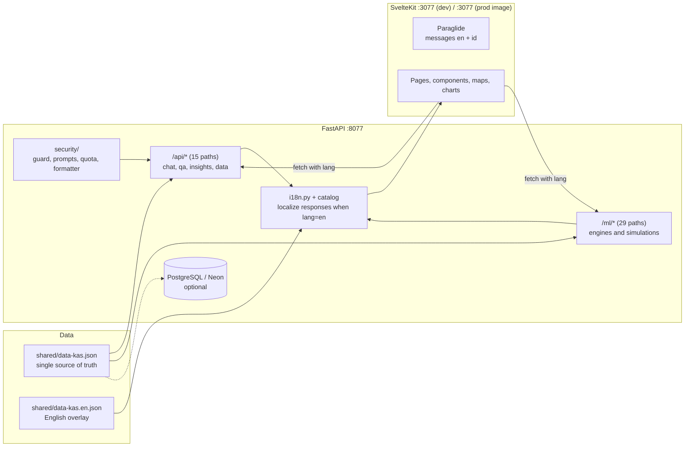
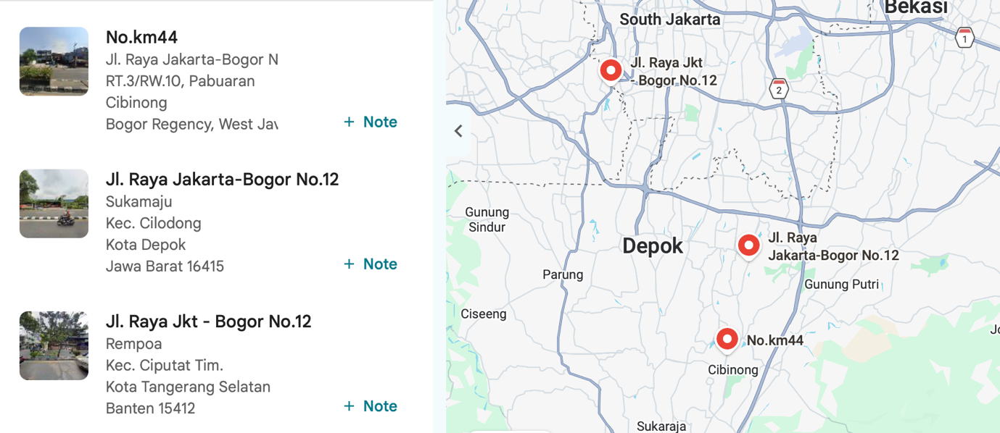
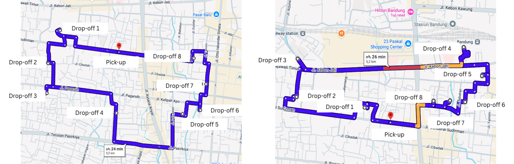

# Omnigistic

**Bilingual (English / Indonesian) decision-support prototype for the ISCEA Global Case Competition 2026 "Delivering Promises" case (GC Logistics).** SvelteKit 2 (Svelte 5 runes, adapter-node) + FastAPI (Python, ML), runs entirely on `localhost`: no deployment, no cloud dependency.

[](https://svelte.dev)
[](https://svelte.dev)
[](https://vite.dev)
[](https://www.typescriptlang.org)
[](https://tailwindcss.com)
[](https://fastapi.tiangolo.com)
[](https://www.python.org)
[](https://nodejs.org)
[](https://inlang.com/m/gerwegn8/plugin-js)
[](#license)

> Bahasa Indonesia: **[README.id.md](README.id.md)**

---

## Table of Contents

- [About](#about)
- [The six strategic questions](#the-six-strategic-questions)
- [Features](#features)
- [Tech stack](#tech-stack)
- [Architecture](#architecture)
- [Project structure](#project-structure)
- [Getting started](#getting-started)
- [Configuration](#configuration)
- [Bilingual (English / Indonesian)](#bilingual-english--indonesian)
- [Engines and models](#engines-and-models)
- [Design system](#design-system)
- [Security](#security)
- [Testing and verification](#testing-and-verification)
- [Numbers and provenance](#numbers-and-provenance)
- [Documentation](#documentation)
- [Troubleshooting](#troubleshooting)
- [Roadmap](#roadmap)
- [Contributing](#contributing)
- [License](#license)
- [Credits and attribution](#credits-and-attribution)
- [Author](#author)

---

## About

The case asks how **GC Logistics** (a fictional Indonesian logistics operator in the ISCEA 2026 case) should fix a business where **fulfilment expense grew faster than sales**. Between 2020 and 2023 fulfilment expense rose 54.9% while net sales rose 48.7%, the partner network expanded 23.9x (20 to 478 partners) without demand alignment, and the company recorded a loss in 2023.

This repository is a **working prototype** of *Omnigistic*: the proposed data-driven operating layer that answers the case's six strategic questions with interactive engines built on the case's own numbers (Table 1 to Table 4, Figure 1 and Figure 2).

What it is:

- **A decision-support prototype**, not a production service. Every engine exposes interactive controls (sliders, thresholds, toggles) that recompute results instead of showing static charts.
- **Runs fully local** (`localhost` only). The submission format is a video of at most 15 minutes, so the app is built to be demonstrated from a laptop.
- **Bilingual**, English by default and Indonesian under `/id`, with a language switcher in the interface.
- **Traceable**: derived numbers are computed in one place (`backend/app/ml/metrics.py`) and reconciled against the case document, including the document's own inconsistency.

What it is not: it is not deployed, has no official data contract with GC Logistics, and its ML models are labelled as presentation prototypes (see the honesty labels in the UI and [Numbers and provenance](#numbers-and-provenance)).

---

## The six strategic questions

Each question maps to one engine and one page. All six are reachable from every role portal.

| # | Question | Engine (endpoint) | Page |
|---|---|---|---|
| Q1 | Should GC move from Direct Operation to a Regional Sponsor model? | `GET\|POST /ml/sponsor/compare`, `GET /ml/sponsor/sensitivity` | `/dashboard/pusat/digital-twin` |
| Q2 | How should dramatic demand swings be handled? | `GET\|POST /ml/sim/surge`, `GET\|POST /ml/forecast` | `/dashboard/hub/surge`, `/dashboard/hub/forecast` |
| Q3 | How should the COD system be fixed? | `POST /ml/cod-cash/risk`, `POST /ml/cod-intel`, `GET /ml/cod-risk/demo` | `/dashboard/kurir/cod-cash`, `/dashboard/kurir/cod-intel` |
| Q4 | What are the roadmap and benefit-cost of sustainability? | `GET /ml/ev-bca`, `GET /ml/metrics/fleet` | `/dashboard/pusat/ev-bca`, `/dashboard/data/fleet` |
| Q5 | Is market expansion profitable? | `GET\|POST /ml/expansion/roi` | `/dashboard/pusat/expansion` |
| Q6 | What other strategy cuts cost while protecting revenue? | `GET /ml/pnl/waterfall`, `GET\|POST /ml/modalshift/optimize` | `/dashboard/pusat/pnl`, `/dashboard/data/multimodal` |

---

## Features

### Six role portals

One shared shell, six perspectives on the same data. Navigation adapts per role (4 content items plus the AI assistant).

| Portal | Role | Focus |
|---|---|---|
| `/dashboard/pusat` | HQ (Dalila) | Financials, Digital Twin, network expansion, ROI, cost waterfall |
| `/dashboard/hub` | Hub (Marwah) | Utilisation, load balancing, capacity alerts, demand forecast |
| `/dashboard/kurir` | Courier (Baits) | Task delivery, route intelligence, COD triage, cash reconciliation, PUDO |
| `/dashboard/data` | Data (Virgiawan) | Address intelligence, complaints, multimodal control tower, fleet and emissions |
| `/dashboard/customer` | Buyer (Sari) | Shop, cart, COD checkout, order tracking, recipient presence |
| `/dashboard/seller` | Seller (Rina) | Products, incoming orders, customer scoring |

### Interactive engines and simulations

- **Challenge engines** for Q1 to Q6 (table above), each with live parameter controls.
- **Network load balancing**: transportation heuristic that diverts overflow from hubs above the critical threshold to hubs with headroom, under a safe floor and a maximum divert fraction.
- **Demand forecast**: seasonal index + OLS trend + event flags, with what-if event strength sliders.
- **Metrics and reconciliation**: derived figures and audit checks for every case table.
- **Modal shift optimizer**: mode choice per corridor against a weighted objective (cost, emissions, SLA).
- **Route intelligence**: candidate corridors with BPR travel-time model, scoring fastest and most efficient routes.

### Interactive pages

Result-changing controls on every simulation page (nothing is a static preset):

| Page | Controls |
|---|---|
| `/dashboard/hub/surge` | Peak amplification and flexible capacity sliders, plus seasonal, festival, and Double 12 presets |
| `/dashboard/hub/capacity` | Demand level (trough, normal, peak) rescaling volume and overflow per hub |
| `/dashboard/hub/load-balance` | Three thresholds (critical, safe floor, maximum divert fraction) and a recomputed diversion plan |
| `/dashboard/hub/forecast` | Three event-strength sliders recomputing projection and fluctuation |
| `/dashboard/kurir/cod-cash` | COD share slider plus four digital interventions |
| `/dashboard/kurir/cod-intel` | COD share, parcels per shift, and intervention toggles |
| `/dashboard/kurir/tasks` and `/dashboard/kurir/pudo` | Route density slider and route picker (fastest or most efficient) |
| `/dashboard/pusat/pnl` | Sustainability lever toggle rebuilding the cost-to-sales bridge |
| `/dashboard/pusat/expansion` | Capex per hub and target utilisation sliders |
| `/dashboard/pusat/roi` | Four levers (COD, EV, fuel, complaints) recomputing ROI, capex, and payback |
| `/dashboard/pusat/digital-twin` | Direct against Regional Sponsor parameters with sensitivity |
| `/dashboard/data/multimodal` | Cost, emissions, and speed weights plus an SLA limit |
| `/dashboard/data/fleet` | EV adoption slider changing the fleet mix and emissions |
| `/dashboard/data/address` | Free-text address with fuzzy matching to three candidates |
| `/dashboard/data/ev-sites`, `/dashboard/data/complaint` | Corridor and coverage parameters with recomputed projections |

### Maps

Leaflet maps with collapsible legends: hub utilisation (search, filter by tier and region, sortable hub list, detail cards), delivery simulation (route, telemetry, PUDO drop), and address disambiguation (three ambiguous candidates for the same street name). Partner PUDO points carry real coordinates and addresses from OpenStreetMap.

### Cross-role order flow

A simulated order journey stored in `localStorage`: buyer checkout, courier handling (packed, picked up, transit, out for delivery, delivered), slot confirmation, COD cash, PUDO diversion, buyer tracking. While a parcel is out for delivery, the buyer can tell the courier whether they are at home and the courier records arrival status, both visible to the other side (the case's root cause: couriers waiting without certainty).

### Bilingual interface

English without a prefix, Indonesian under `/id`, with a switcher in the top bar, landing page, and login. The choice is stored in a cookie and survives navigation.

### Nigi AI assistant

Optional LLM (configured through environment variables) with a deterministic fallback: a curated QA bank, role greeting, and insights from the case data. Without API credentials the assistant still answers, and it never crashes.

### Material 3 responsive shell

Bottom navigation (compact), navigation rail (medium), and full sidebar (expanded), backed by a working light and dark theme.

---

## Tech stack

| Layer | Technology | Version |
|---|---|---|
| Frontend framework | SvelteKit (adapter-node) | 2.70.3 |
| UI library | Svelte (runes) | 5.57.0 |
| Build tool | Vite | 8.2.2 |
| Language | TypeScript | 6.0 |
| Styling | Tailwind CSS (v4) | 4.3.3 |
| i18n | `@inlang/paraglide-js` | 2.25.4 |
| Charts | Apache ECharts | 6.1.0 |
| Maps | Leaflet | 1.9.4 |
| Motion | GSAP | 3.15.0 |
| Fonts | Fontsource variable: Fraunces, Inter, JetBrains Mono, Space Grotesk | 5.3.0 |
| Backend | FastAPI + Uvicorn | 0.115+ / 0.30+ |
| Runtime | Python (images use 3.12-slim, verified locally on 3.14.4) | 3.12+ |
| Data / ML | pandas, numpy, statsmodels, scikit-learn, rapidfuzz | see `backend/requirements.txt` |
| Persistence (optional) | SQLModel + psycopg (PostgreSQL / Neon) | 0.0.16+ / 3.2+ |
| LLM client (optional) | openai SDK | 1.40+ |
| Tooling | ESLint, Prettier, ruff, playwright-core, Make, Docker Compose | see `frontend/package.json` |

---

## Architecture



- **Data flow**: `shared/data-kas.json` is the single source of truth (23 hubs, demand, QA bank, root causes, KPI targets). The backend serves it through `/api/*` and `/ml/*`; the frontend fetches it with the active language. PostgreSQL is optional and, when absent, the backend falls back to the JSON file with zero external dependencies.
- **Backend**: 45 documented paths, 54 operations (15 under `/api`, 29 under `/ml`, plus the root). Engines live in `backend/app/ml/`, HTTP routing in `backend/app/api/`, request hardening in `backend/app/security/`, and text localisation in `backend/app/i18n.py`.
- **Frontend**: SvelteKit with `adapter-node`. Server-rendered pages whose data arrives from the API at runtime, with a Paraglide message catalogue for both languages.
- **i18n boundary**: engines keep returning Indonesian terms (the contract asserted by the test suite); translation happens at the API boundary, so numbers and case terms stay identical in both languages. See [Bilingual](#bilingual-english--indonesian).

---

## Project structure

```
omnigistic/
├── shared/
│   ├── data-kas.json              # single source of truth (never modified by i18n)
│   └── data-kas.en.json           # English overlay, merged index by index at request time
├── backend/
│   ├── app/
│   │   ├── main.py                # FastAPI app + Swagger at /docs
│   │   ├── api/                   # chat, qa, insights, data, ml_routes, localized_route
│   │   ├── ml/                    # 16 engine modules (see Engines and models)
│   │   ├── security/              # guard, prompts (prompt-injection wrap), quota, formatter
│   │   ├── db/                    # loader (JSON + overlay merge), seed, session (optional Postgres)
│   │   ├── i18n.py                # translate() + localize() for API responses
│   │   └── i18n_messages.json     # Indonesian engine text -> English catalogue
│   ├── tests/run_tests.py         # self-contained test harness (no pytest), 392 assertions
│   ├── Dockerfile                 # production image (multi-stage)
│   └── Dockerfile.dev             # dev image (uvicorn --reload)
├── frontend/
│   ├── messages/{en,id}.json      # Paraglide message catalogue
│   ├── project.inlang/            # Paraglide project settings (baseLocale en, locales en + id)
│   ├── src/
│   │   ├── app.css                # design tokens, two themes, utilities
│   │   ├── hooks.server.ts        # Paraglide middleware, <html lang> handling
│   │   ├── lib/i18n/              # bilingual content + shared label helpers
│   │   ├── lib/components/        # shell, cards, AI assistant, maps UI
│   │   ├── lib/map/               # Leaflet maps (delivery, hub, address, coordinate picker)
│   │   ├── lib/stores/            # role, shop, widgets, theme
│   │   ├── lib/shop/              # catalogue, analytics, reputation
│   │   └── routes/                # 53 pages: landing, login, analisis, whitepaper, dashboard/*
│   └── scripts/                   # 18 e2e suites, 3 i18n suites, utilities (see Testing)
├── assets/                        # case figures used in this README
├── docs/hasil-analisis-2026-09-19.md  # canonical analysis of the six challenges
├── docker-compose.yml             # dev (default), prod and db profiles
├── Makefile                       # canonical command entry point (make help)
└── LICENSE                        # proprietary, all rights reserved
```

---

## Getting started

### Prerequisites

| Requirement | Notes |
|---|---|
| Docker + Docker Compose | Recommended path. Nothing else is needed (Node and Python run inside the images). |
| Node.js 22 | Only for the non-Docker frontend path |
| Python 3.12 or newer | Only for the non-Docker backend path (verified locally on 3.14.4) |
| GNU Make | The command wrapper used throughout this README |
| Chromium (optional) | Only to run the browser test suites |

### Path A: Docker (recommended)

```bash
make up          # docker compose up -d --build  (dev, hot reload)
```

| Service | URL | Notes |
|---|---|---|
| Frontend (English) | http://127.0.0.1:3077 | Vite dev server with hot reload, source bind-mounted |
| Frontend (Indonesian) | http://127.0.0.1:3077/id | Same app, Indonesian locale |
| API | http://127.0.0.1:8077 | FastAPI, `uvicorn --reload` |
| API documentation | http://127.0.0.1:8077/docs | Swagger UI, usable as API evidence |

Other Docker profiles:

```bash
make up-db       # add a local PostgreSQL (profile "db"), backend uses it, auto-seeded
make up-prod     # production images (no bind mounts)
make down        # stop containers
make down-v      # stop and remove volumes (database data included)
```

After adding a Node dependency, run `make up-refresh`: the dev container keeps `node_modules` in an anonymous volume created from the old image, so a plain rebuild does not install the new package.

### Path B: local, without Docker

```bash
make install              # backend venv + pip, frontend npm ci

# terminal 1
make backend-dev          # FastAPI on http://127.0.0.1:8077 (Swagger at /docs)

# terminal 2
make frontend-dev         # SvelteKit on http://127.0.0.1:3177
```

To serve a production build locally instead:

```bash
make build-frontend && make frontend-serve   # node build on http://127.0.0.1:3179
```

### Path C: Makefile reference

`make help` prints every target. The most used ones:

| Command | Purpose |
|---|---|
| `make install` | Install backend and frontend dependencies |
| `make check` | Green gate: backend assertions + frontend type check |
| `make verify` | `check` plus validation of `shared/data-kas.json` |
| `make test` | Backend assertions + frontend type check |
| `make lint` | ruff (backend) + ESLint (frontend) |
| `make e2e` | Main end-to-end suite (requires frontend and backend running) |
| `make e2e-help` | Prerequisites for the e2e suites |
| `make routes` | List every backend endpoint from the live OpenAPI document |
| `make status` | Git and container status summary |
| `make clean` | Remove build caches and artefacts |

Ports and host can be overridden without editing files, for example `make backend-dev BACKEND_PORT=9077` or `make frontend-dev FRONTEND_PORT=4177`.

---

## Configuration

| Variable | Default | Purpose |
|---|---|---|
| `PUBLIC_API_BASE_URL` | `http://127.0.0.1:8077` | API base used by the browser (`frontend/.env`, tracked because it is public) |
| `SKIP_DB` | `1` in Docker dev | When `1`, all endpoints read `shared/data-kas.json` (no database needed) |
| `DATABASE_URL` | unset | PostgreSQL or Neon connection string. When set with `SKIP_DB=0`, data comes from the database |
| `DATA_KAS_PATH` | `/shared/data-kas.json` | Location of the canonical case data inside the container |
| `AI_API_BASE_URL`, `AI_API_KEY`, `AI_MODEL` | unset | Optional LLM for the chat assistant. Without them the assistant uses its fallback QA bank |
| `BACKEND_PORT`, `FRONTEND_PORT` | `8077`, `3177` | Host ports for the non-Docker path (Makefile overrides) |
| `BACKEND_HOST`, `FRONTEND_HOST` | `127.0.0.1` | Bind host for Docker port publishing |

Secrets are never committed: `backend/.env` is ignored, while `frontend/.env` is tracked on purpose because it only holds the public API URL.

---

## Bilingual (English / Indonesian)

### Using it

| Locale | URL | `<html lang>` |
|---|---|---|
| English (default, no prefix) | `/`, `/dashboard/pusat/pnl` | `en` |
| Indonesian | `/id`, `/id/dashboard/pusat/pnl` | `id` |

The switcher lives in the top bar (and on the landing and login pages). Switching keeps the current page, only the prefix changes, and the choice is stored in a cookie (`PARAGLIDE_LOCALE`).

### How it works

| Piece | Location | Role |
|---|---|---|
| Locale routing and cookie | `frontend/project.inlang/settings.json`, `src/hooks.server.ts`, `src/hooks.ts` | Paraglide middleware, `reroute` to de-localised paths |
| Message catalogue | `frontend/messages/{en,id}.json` | All page and component strings, used as `m.key()` |
| Bilingual long-form content | `frontend/src/lib/i18n/content.ts` | Landing, analysis, whitepaper and login copy for both locales |
| Label helpers | `frontend/src/lib/i18n/labels.ts` | Role, courier and actor labels resolved at render time |
| Backend translation | `backend/app/i18n.py`, `backend/app/i18n_messages.json` | Translates API payloads when `?lang=en` is present |
| Case-data overlay | `shared/data-kas.en.json` | English for QA bank, suggested questions, KPI targets and insights, merged index by index |
| Request language | `frontend/src/lib/api/index.ts` | Appends `lang=<locale>` to every API call and caches per locale |

Design decisions worth knowing:

1. **Engines keep returning Indonesian.** The ML modules were not modified, so the 392 backend assertions keep passing. Translation happens once, at the API boundary.
2. **Numbers and case terms are never translated.** Names of hubs and cities, `COD`, `GC Logistics`, `ISCEA`, `PUDO`, `NPV`, `BCR`, `ROI`, `SLA`, `MAPE`, `Direct Operation`, `Regional Sponsor` and similar stay identical in both languages. This is verified automatically (see [Testing](#testing-and-verification)).
3. **No abbreviations in interface text.** The Indonesian side writes `juta`, `miliar`, `triliun`, `ribu`, `menit`, `tahun`, `kilometer per jam` instead of `jt`, `M`, `T`, `rb`, `mnt`, `thn`, `km/j`.
4. **Message values are evaluated at render time.** No locale-dependent module-level constants, so a server process can serve both locales without freezing the first one.
5. **Search keywords stay Indonesian.** The QA bank's `keywords` field is matching data, not interface text, so it is intentionally left untranslated.

### Adding text

| Kind of text | Where to add |
|---|---|
| Page or component string | Add the key to **both** `frontend/messages/en.json` and `id.json`, then call `m.key()`. Parameterised: `m.key({ name })` with `{name}` in the value |
| Landing, analysis, whitepaper, login copy | Add to both the `en` and `id` block in `lib/i18n/content.ts` |
| Engine text (backend) | Add the Indonesian text as the key in `backend/app/i18n_messages.json` and its English value. Do not change the engine string: the test suite asserts it |
| Case data (QA bank, KPI targets, insights) | Add the matching field at the same index in `shared/data-kas.en.json`. Never edit `shared/data-kas.json` for translation |

---

## Engines and models

All endpoints are documented and runnable from Swagger at `/docs`. Every engine is labelled as a prototype and separates case data from team assumptions.

| Engine | Endpoint | Answers | Interactive controls | Primary source |
|---|---|---|---|---|
| Sponsor comparator | `GET\|POST /ml/sponsor/compare` | Q1 | Equity, fee percentages, region selection, sensitivity | Tables 3 and 4 |
| Peak-surge stress test | `GET\|POST /ml/sim/surge` | Q2 | Peak multiplier, flexible capacity, presets | Table 1 capacity, Table 4 demand |
| Demand forecast | `GET\|POST /ml/forecast` | Q2 | Horizon, event strength (promo, TikTok shock) | Table 4 |
| COD cash-reconciliation risk | `POST /ml/cod-cash/risk` | Q3 | COD share, four digital interventions | Table 4 volume, Figure 2 |
| COD shift impact | `POST /ml/cod-intel` | Q3 | COD share, parcels per shift, intervention toggles | Figure 2 |
| Predictive COD risk | `GET /ml/cod-risk/demo`, `POST /ml/cod-risk` | Q3 | Parcel attributes (value, hour, ambiguity, zone) | Synthetic training data, thresholds are team assumptions |
| Route intelligence | `GET\|POST /ml/route/plan` | Q2, Q3 | Distance, density override, base speed | BPR delay model, team assumptions |
| EV benefit-cost analysis | `GET /ml/ev-bca` | Q4 | Scenario, distance, escalation, Monte Carlo | Market benchmarks, BAU assumptions |
| Fleet and emissions | `GET /ml/metrics/fleet` | Q4 | EV adoption slider (frontend) | Case fleet figures |
| Expansion ROI | `GET\|POST /ml/expansion/roi` | Q5 | Capex per hub, target utilisation | Tables 3 and 4, Table 1 capacity |
| Cost waterfall and P&L | `GET /ml/pnl/waterfall` | Q6 | Sustainability levers on or off | Tables 3 and 4 |
| Modal shift optimizer | `GET\|POST /ml/modalshift/optimize` | Q6 | Mode weights, SLA limit, allowed modes | Corridor geography, team assumptions |
| Load balancing | `GET\|POST /ml/optimize/load-balance` | Operations | Critical threshold, safe floor, maximum divert fraction | Table 1 utilisation |
| Metrics and audit | `GET /ml/metrics/regions`, `GET /ml/metrics/financial`, `GET /ml/metrics/demand`, `GET /ml/metrics/fleet`, `GET /ml/metrics/audit` | All | Read-only | Tables 1 to 4 |
| Address parsing | `GET\|POST /ml/address-parse` | Operations | Free-text address | Figure 1 |

Honesty labels are part of the contract: text that comes from team assumptions is labelled as such in the API payload (`note`) and in the interface.

---

## Design system

A token-driven editorial system in `frontend/src/app.css`, with two complete themes and a working toggle.

- **Light theme ("editorial paper")**: warm cream background `#f6f3ec`, ink `#16140f`, emerald primary `#0f8a4d`, soft green accent `#e4f5ea`, hairline borders `rgba(22, 20, 15, 0.12)`.
- **Dark theme ("editorial dark")**: near-black with a green undertone `#0a0d0b`, warm off-white ink `#e8e6df`, mint primary `#7fffb4`, very thin borders `rgba(232, 230, 223, 0.1)`.
- **Copper accent** `#c98a5e` used sparingly as the secondary accent in both themes (charts, highlights, warnings).
- **Typography**: Fraunces (editorial serif) for headings, Inter for body text, JetBrains Mono for data and technical labels. Space Grotesk remains available. All four are self-hosted through Fontsource variable fonts.
- **Charts**: a five-colour token scale (`--chart-1` to `--chart-5`) driven by emerald, copper, and neutral tones, consumed by shared ECharts option builders.
- **Components**: reusable `Button`, `Card`, and `Input`, plus an internal `Icon` component for interface glyphs. FontAwesome is bundled for a few decorative marks (for example the assistant sparkle), and emoji are used as compact map and telemetry markers (courier, parcel, hub, PUDO point, battery).
- **Material 3 shell**: bottom navigation (compact), navigation rail (medium), full sidebar (expanded), collapsible with `Ctrl` or `Cmd` + `B`, preference stored in `localStorage`.
- **Accessibility**: two themes verified, visible focus states, keyboard-operable controls, `prefers-reduced-motion` respected, and an anti-flash theme script in `app.html`.

Reasons behind the main decisions: the palette separates two hierarchy levels (emerald for actions and data, copper only for attention) instead of covering the page in one accent, and the serif heading face distinguishes editorial pages (landing, analysis, whitepaper) from data-dense dashboard pages.

---

## Security

- **Input hardening**: `backend/app/security/guard.py` inspects incoming chat text, blocks injection attempts, and `prompts.py` wraps untrusted user text before it reaches a model.
- **Quota**: `backend/app/security/quota.py` rate-limits the assistant and reports quota status to the client instead of failing silently.
- **Output scrubbing**: `backend/app/security/formatter.py` normalises assistant output before it is returned.
- **No committed secrets**: `backend/.env` is ignored. `frontend/.env` is tracked on purpose and contains only the public API URL.
- **Optional dependencies**: without `AI_*` credentials and without a database the application still runs, degrading to the curated QA bank and the JSON data file.
- **Local only**: the stack binds to `127.0.0.1` by default. Exposing it to a network is a deliberate change of `BACKEND_HOST` or `FRONTEND_HOST`.

---

## Testing and verification

Everything below was run on this repository and the numbers are the actual output.

### Backend

```bash
make test-backend      # self-contained harness, no pytest, no server required
```

**392 assertions, all passing.** Covers every engine, the reconciliation checks, and the Indonesian response contract.

### End-to-end (browser)

Requires the frontend and backend running (`make up`) plus Chromium. Run one suite at a time, for example:

```bash
cd frontend
E2E_BASE=http://127.0.0.1:3077 node scripts/e2e.mjs          # main suite, 52 checks
E2E_LANG=en E2E_BASE=http://127.0.0.1:3077 node scripts/e2e-sidebar.mjs   # language-agnostic run
```

| Suite | Checks | Focus |
|---|---|---|
| `e2e.mjs` | 52 | Core flows across portals, pages, and API calls |
| `e2e-sims.mjs` | 36 | Interactive simulations (capacity, load balance, forecast, ROI, fleet, address) |
| `e2e-pudo.mjs` | 35 | PUDO network and map legend with real coordinates |
| `e2e-orders.mjs` | 31 | Cross-role order coherence |
| `e2e-case.mjs` | 25 | Challenge flows (surge, COD cash, expansion, P&L) |
| `e2e-map-modal.mjs` | 21 | Full-screen map modal and collapsible legend |
| `e2e-engines.mjs` | 18 | Analytics engine endpoints |
| `e2e-delivery-sim.mjs` | 17 | Courier delivery simulation |
| `e2e-sidebar.mjs` | 15 | Sidebar states across breakpoints, passes in both locales |
| `e2e-customer-accordion.mjs` | 15 | Order accordion for buyers |
| `e2e-toast.mjs` | 13 | Notification behaviour |
| `e2e-tasks-map.mjs` | 13 | Delivery task map |
| `e2e-cod-triage.mjs` | 13 | COD triage consistency across courier pages |
| `e2e-audit-fixes.mjs` | 11 | Regression guard for earlier audit fixes |
| `e2e-widgets.mjs` | 9 | Dashboard widget drawer |
| `e2e-route.mjs` | 9 | Route intelligence corridors |
| `e2e-arrival.mjs` | 8 | Recipient presence exchange |
| `e2e-offline.mjs` | 8 | Error states when the API is unreachable |
| `redteam.mjs` | security | Prompt-injection and leakage checks (reports no leak) |

**349 checks across 18 passing suites** (plus security and DOM utilities).

### Internationalisation

```bash
cd frontend
node scripts/i18n-sweep.mjs              # 53 routes x 2 locales over HTTP: 106 checks
node scripts/i18n-sweep.mjs --browser    # 53 routes rendered in Chromium: 53 checks
node scripts/i18n-smoke.mjs              # both locales plus language switcher: 74 checks
node scripts/i18n-parity.mjs             # identical numbers across locales: 6 canonical pages
```

The sweep checks the `lang` attribute, leftover message keys, double-escaped entities, and language leaks in both directions (Indonesian on English pages and English function words on Indonesian pages, excluding case terms). The parity script renders the six canonical pages in both locales, normalises thousand and decimal separators, and fails if any number differs.

### Gates

```bash
make check     # backend assertions + frontend type check (svelte-check: 0 errors)
make verify    # check + validate shared/data-kas.json
```

---

## Numbers and provenance

Derived figures are computed in `backend/app/ml/metrics.py` and exposed through `/ml/metrics/*`, so the interface never hardcodes them. Values verified against the live API and the case document:

| Figure | Value | Source |
|---|---|---|
| Total demand 2023 | 1,110 million parcels | Table 4 rows |
| Demand fluctuation | 34.6% (78 million in January to 105 million in April) | Table 4 |
| TikTok Shop suspension shock | -29.8% e-commerce | Table 4 |
| Fleet | 14,180 units (12,500 motorcycles, 280 vans, 560 trucks, 840 line-haul) | Case fleet data |
| EV target 2026 | 200 units, 1.41% of the fleet | Case target |
| Hub network | 23 hubs across 6 regions; Java 8 hubs at 69.4% average utilisation, Maluku and Papua 2 hubs at 30.1% | Table 1 |
| COD route time | 138 minutes for 8 parcels against 75 minutes non-COD (5.3 km) | Figure 2 |
| Cost to sales bridge | 31.34% (2023) to 29.40% (volume absorption) to 28.35% (seven levers) to 26.76% (selective sponsor) | Tables 3 and 4 |
| Complaint rate | 5.5 per million parcels, target below 3 | Case KPI |
| Reconciliation finding | Table 4 e-commerce rows sum to 651 million while the document prints 641 million (10 million gap). The row sum is treated as canonical and the gap is reported by `/ml/metrics/audit` and on the Methodology page | Case audit |

Case figures are shown in the interface and in [`docs/hasil-analisis-2026-09-19.md`](docs/hasil-analisis-2026-09-19.md). Team assumptions (shares, tariffs, emission factors, model thresholds) are labelled as assumptions wherever they appear.

The live audit endpoint reports these checks, all passing:

- Number of hubs = 23
- Total demand 2023 = 1,110 million parcels
- Total e-commerce (row sum) = 651 million, the document prints 641 million
- Total fleet = 14,180 units
- EV target share = 1.41% of the fleet



*Figure 1 from the case: the same street name resolves to three different locations, the root of address complaints.*



*Figure 2 from the case: 8 COD parcels take 138 minutes against 75 minutes for non-COD.*

---

## Documentation

| Resource | What it contains |
|---|---|
| [`docs/hasil-analisis-2026-09-19.md`](docs/hasil-analisis-2026-09-19.md) | Canonical analysis of the six challenges (what, how, why) |
| http://127.0.0.1:8077/docs | Swagger UI for all 54 backend operations, usable as API evidence |
| `make help` | Every project command |
| `make routes` | The endpoint list read from the live OpenAPI document |
| `assets/` | Case figures reproduced in this README |

---

## Troubleshooting

| Symptom | Cause | Fix |
|---|---|---|
| `Cannot find module '<pkg>'` after adding a dependency | Dev container keeps `node_modules` in an anonymous volume built from the previous image | `make up-refresh` |
| Pages show local or fallback data, API seems offline | Backend container not running, or the browser cannot reach `PUBLIC_API_BASE_URL` | `make ps`, then `make up`; check `PUBLIC_API_BASE_URL` |
| Page loads but nothing is clickable | `npm run build` or `svelte-check` was executed while the dev server was serving the same tree, leaving it un-hydrated | Restart the frontend container: `docker restart omnigistic-frontend` |
| Port already in use | Another process holds `3077` or `8077` | Override: `make frontend-dev FRONTEND_PORT=4177` or change the compose variables |
| Browser suites fail to launch | Chromium is not installed for `playwright-core` | `npx playwright@1.63.0 install chromium`, then rerun |
| Chat answers are generic | No LLM credentials configured | Expected: the assistant falls back to the curated QA bank. Set `AI_API_BASE_URL`, `AI_API_KEY`, `AI_MODEL` for model answers |

---

## Roadmap

Honest state of the project:

- **Deployment**: none by design. The submission is a recorded walkthrough, so the stack targets `localhost`.
- **ML models**: forecast, COD risk, and address parsing are presentation prototypes. The COD model trains on synthetic data, and the forecast reports in-sample error, which is labelled in the interface.
- **Database**: PostgreSQL is optional. The default path reads the JSON data file with no external dependency.
- **Assistant**: model answers require credentials; the deterministic fallback is the shipped default.
- **Known environment limits**: `ai-security-test.mjs` needs LLM credentials, and the browser suites need Chromium installed.

---

## Contributing

This repository is a competition submission, so external contributions are not expected. If you work in the repository anyway:

1. Create a branch, keep changes focused.
2. Keep the gate green: `make check` (backend assertions plus type check) and, when touching the interface, the relevant e2e suite.
3. For interface text, add both languages (see [Adding text](#adding-text)) and run the i18n suites.
4. Commit with Conventional Commits (`feat:`, `fix:`, `refactor:`, `docs:`, `test:`, `chore:`) and stage files explicitly rather than everything at once.

---

## License

**Proprietary, all rights reserved.** See [LICENSE](LICENSE). The repository is published for competition review; no permission is granted to use, copy, modify, or redistribute it without written consent from the author. Case materials belong to their respective owners (see below).

---

## Credits and attribution

- **Case material**: ISCEA Global Case Competition 2026, "Delivering Promises" (GC Logistics). Case figures are reproduced in `assets/` for documentation; all case rights remain with their owners. Written by Lala Ayu Kantari and Prof. I Nyoman Pujawan, ISCEA Indonesia.
- **Map data**: coordinates and addresses come from OpenStreetMap contributors, licensed under the Open Database License (ODbL). Map tiles are rendered by Leaflet.
- **Open source**: SvelteKit, Svelte, Vite, Tailwind CSS, Paraglide (inlang), Apache ECharts, Leaflet, GSAP, Fontsource, FastAPI, Uvicorn, SQLModel, pandas, numpy, statsmodels, scikit-learn, rapidfuzz, and the OpenAI Python SDK.
- **Icons and fonts**: internal SVG icon set, self-hosted variable fonts through Fontsource.

---

## Author

**virgiawanprima** ([@b4its](https://github.com/b4its)) · virgiawanprimarizky@gmail.com

Repository: https://github.com/b4its/omnigistic
